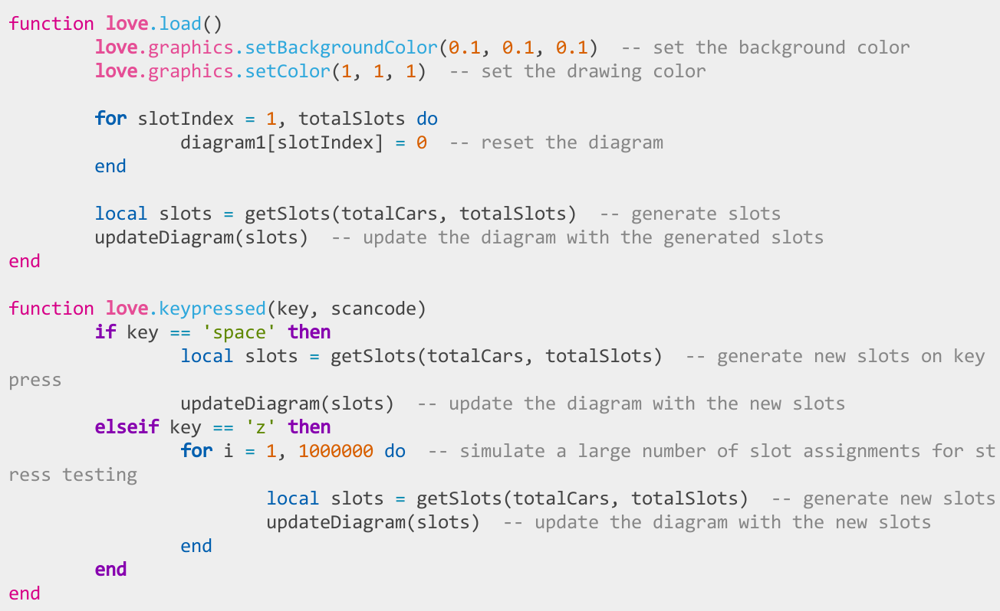

<h1 align="center">♡&nbsp;&nbsp; <a href="https://love2d.org">LÖVE</a> <a href="https://www.vim.org/">Vim</a> syntax&nbsp;&nbsp;♡</h1>

[](https://github.com/yorik1984/love2d-vim-syntax/actions/workflows/update-love-api.yml)
[](https://github.com/yorik1984/love2d-vim-syntax/blob/main/LICENSE)
[](https://www.lua.org/)
[](https://github.com/love2d-community/love-api)
[](https://www.vim.org/)

**Beautiful syntax highlighting 📝**

## ✨ About

**love2d-vim-syntax** is a comprehensive plugin for [Vim](https://www.vim.org/) that highlight [LÖVE](http://love2d.org) syntax in your editor.

- 🎨 **Syntax Highlighting** — Colors LÖVE functions, modules, types, and callbacks
- 🔧 **Customizable** — Flexible styling options for Vim

### Features highlighted:

```lua
-- LÖVE functions light up automatically
love.graphics.rectangle("fill", 100, 100, 200, 200)

-- Callbacks are specially highlighted
function love.load()
end

-- Configuration flags in conf.lua get special treatment
function love.conf(t)
    t.window.width = 800
    t.window.height = 600
end
```

<!-- TOC -->

## Table of Contents

- [📦 Installation](#📦-installation)
- [🔧 Settings](#🔧-settings)
- [🔄 Rebuilding the API](#🔄-rebuilding-the-api)
  - [🤖 Automated Workflow](#🤖-automated-workflow)
  - [✋ Manual Generation (Optional)](#✋-manual-generation-optional)
- [🎨 Screenshots](#🎨-screenshots)
- [📚 References & Related Projects](#📚-references--related-projects)
- [©️ Credits](#©️-credits)

<!-- /TOC -->

## 📦 Installation

#### [vim-plug](https://github.com/junegunn/vim-plug)

```vim
Plug "yorik1984/love2d-vim-syntax"
```

## 🔧 Settings

The style of the syntax highlighting can be changed by setting `g:love_colors_<name>` in your `.vimrc`:

```vimscript
let g:love_colors_love = 'guifg=#E54D95 ctermfg=162 gui=bold cterm=bold'
```
You can set the string to any valid highlighting specification (see `:help highlight-args`). Defaults are:
| Highlight Group  | Variable Name            | Parameters (GUI/CTERM)                          |
| ---------------- | ------------------------ | ----------------------------------------------- |
| **Love**         | `g:love_colors_love`     | `guifg=#E54D95 ctermfg=162 gui=bold cterm=bold` |
| **Lovet**        | `g:love_colors_module`   | `guifg=#E54D95 ctermfg=162`                     |
| **LoveDot**      | `g:love_colors_module`   | `guifg=#E54D95 ctermfg=162`                     |
| **LoveModule**   | `g:love_colors_module`   | `guifg=#E54D95 ctermfg=162`                     |
| **LoveType**     | `g:love_colors_type`     | `guifg=#E54D95 ctermfg=162`                     |
| **LoveFunction** | `g:love_colors_function` | `guifg=#2FA8DC ctermfg=38`                      |
| **LoveMethod**   | `g:love_colors_function` | `guifg=#2FA8DC ctermfg=38`                      |
| **LoveCallback** | `g:love_colors_callback` | `guifg=#2FA8DC ctermfg=38`                      |
| **LoveConf**     | `g:love_colors_conf`     | `guifg=#2FA8DC ctermfg=38`                      |

## 🔄 Rebuilding the API

### 🤖 Automated Workflow

This plugin uses **GitHub Actions** to automatically stay up-to-date with the latest LÖVE API:

| Feature      | Details                                                                   |
| ------------ | ------------------------------------------------------------------------- |
| **Schedule** | Every Monday at 00:30 UTC                                                 |
| **Trigger**  | Manual dispatch via Actions tab                                           |
| **Source**   | [love2d-community/love-api](https://github.com/love2d-community/love-api) |
| **Updates**  | Vim syntax files                                                          |

**How it works:**

1. 🔄 Fetches the latest LÖVE API specification
2. 🎨 Updates syntax highlighting rules
3. 🚀 Automatically commits changes to the repository
4. 📌 Creates version branches (e.g., `11.5`, `12.0`) for API version tracking

> [!NOTE]
> The badge at the top of this README always shows the current LÖVE API version supported by this plugin.

### ✋ Manual Generation (Optional)

> [!TIP]
> **You don't need to do this!** The automated workflow keeps everything up-to-date.  
> Manual generation is only for:
> - Testing custom modifications
> - Contributing to plugin development
> - Offline environments without GitHub Actions

If you still want to generate files manually:

- Prerequisites:
```
# Ensure these are installed
git --version
lua -v           # Lua 5.1
```

- Configure (optional):
Edit build/env.txt to set custom paths:
```
lua="lua5.1"     # Change to your Lua version
```

- Run the generator:
```bash
# On Linux/Mac
chmod +x build/gen.sh
./build/gen.sh

# On Windows
build/gen.bat
```

- Generated files:
    - 🎨[`after/syntax/lua.vim`](after/syntax/lua.vim) — Vim syntax file
    - 🧪[`test/example/api_full_list.lua`](test/example/api_full_list.lua) — Test preview file with full API-list
    - ⚙️[`test/example/conf.lua`](test/example/conf.lua) — Test preview `love.conf()`

## 🎨 Screenshots

**[papercolor-theme](https://github.com/NLKNguyen/papercolor-theme)**

<div align="center">
  
</div>

## 📚 References & Related Projects

+ **[love2d-definitions](https://github.com/yorik1984/love2d-definitions)**<br>
[LuaCATS](https://luals.github.io/wiki/annotations/) definition for [LÖVE](https://love2d.org/) framework.
Creates `---@class` and `---@alias` definitions for perfect autocompletion and type checking in IDEs with LuaCATS.
    - **🤖 Automated Updates:** Uses GitHub Actions to stay in sync with the official love-api, just like this plugin.
    - **📦 Ready-to-Use:** Provides a pre-generated `library/` folder that you can directly add to your workspace library.
    - **🧠 Smart Type System:** Intelligently handles type unions, plural forms (e.g., `tables` → `table[]`), optional parameters, and function overloads.
    - **📌 Version Branches:** Includes branches for specific LÖVE versions (e.g., `11.5`), so you can use annotations that match your project.

+ **[love2d-docs.nvim](https://github.com/yorik1984/love2d-docs.nvim)**<br>
Is a comprehensive plugin for [Neovim](https://neovim.io/) and [Vim](https://www.vim.org/) that brings the entire [LÖVE](http://love2d.org) game framework documentation right into your editor.
    - 📖 **Built-in Help** — Complete LÖVE API documentation accessible via `:help LOVE-*`

+ **[love2d-tresitter.nvim](https://github.com/yorik1984/love2d-treesitter.nvim)**<br>
Is a comprehensive plugin for [Neovim](https://neovim.io/) that highlight [LÖVE](http://love2d.org) syntax in your editor.
Provides complete LÖVE API syntax highlighting for LÖVE functions, modules, types, and callbacks, with full **[Treesitter](https://github.com/nvim-treesitter/nvim-treesitter)** support.
    * **🤖 Automated Updates:** Uses GitHub Actions to stay in sync with the official love-api, just like this plugin.
    * **⚙️ Fully Customizable:** Offers flexible styling options for colors and font styles (bold, italic, etc.).
    * **📌 Version Branches:** Maintains version-specific branches (e.g., `11.5`) to match different LÖVE releases.

## ©️ Credits

* Original Author: [Davis Claiborne](https://github.com/davisdude) — Created and maintained the original [vim-love-docs](https://github.com/davisdude/vim-love-docs)
* Powered by: [love-api](https://github.com/love2d-community/love-api) — Community-maintained LÖVE API specification


<div align="center">
  <sub>
    Built with ♡ for the LÖVE community
    <br>
    <a href="https://github.com/yorik1984/love2d-vim-syntax/issues">Report Issue</a> ·
    <a href="https://github.com/yorik1984/love2d-vim-syntax/discussions">Discussion</a> ·
    <a href="https://love2d.org/">LÖVE</a>
  </sub>
</div>
